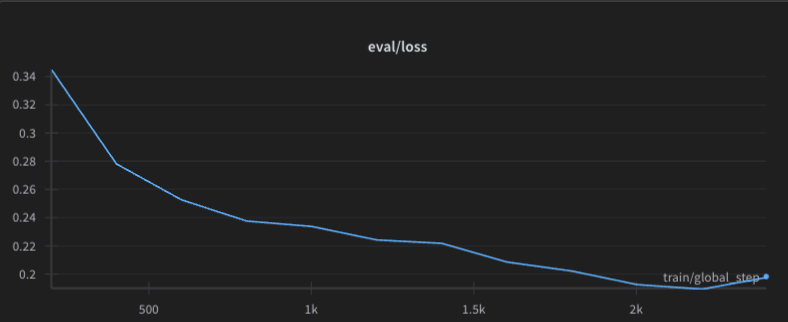
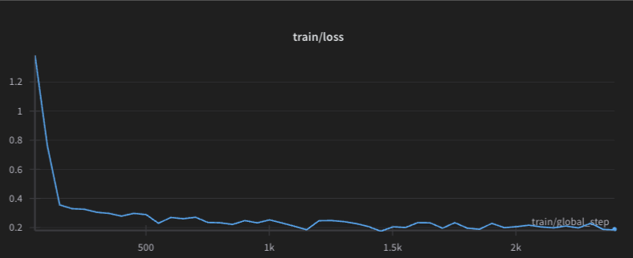
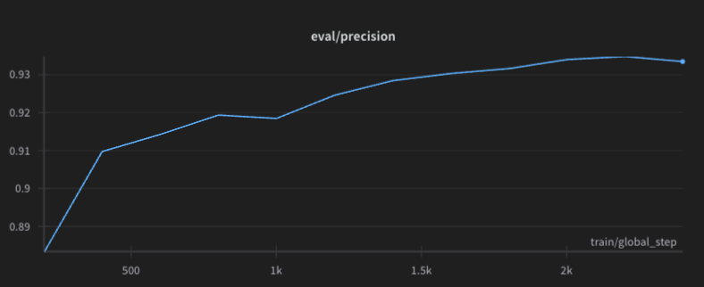
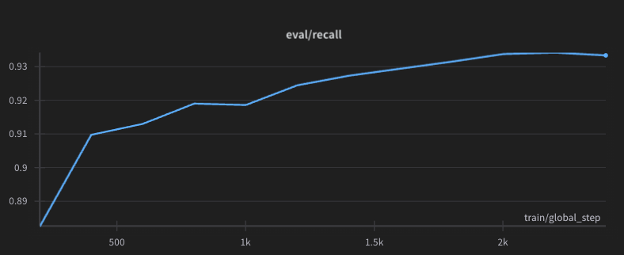

# Parameter-Efficient Fine-Tuning of BERT for Text Classification on AGNEWS Dataset

## Authors
- Joseph Amigo (ja5009@nyu.edu)
- Rigved Shirvalkar (rss9347@nyu.edu)
- Om Thakur (ot2131@nyu.edu)

## Overview
This project explores parameter-efficient fine-tuning of BERT-based models, specifically RoBERTa, for text classification on the AGNEWS dataset using Low-Rank Adaptation (LoRA). Our goal was to maximize classification accuracy while keeping trainable parameters under 1 million.

Through extensive experimentation with model architectures, LoRA configurations, and data preprocessing techniques, our best model achieved **84.725% test accuracy** using RoBERTa-base with rank-6 LoRA adapters applied to attention matrices (query, key, value), an alpha value of 14, and optimized preprocessing.

## Key Features
- Parameter-efficient fine-tuning using LoRA
- Extensive experimentation with different model architectures
- Optimized data preprocessing techniques
- Balanced performance and efficiency (under 1M trainable parameters)
- Detailed visualizations of training metrics

## Usage
Simply download and run the repository on colab

## Methodology

### Base Architecture Selection
Two variants of the BERT architecture were evaluated:
- **RoBERTa-base (125M parameters)** – Offered a strong balance between performance and controllable parameter footprint.
- **RoBERTa-large (355M parameters)** – Delivered higher baseline accuracy but required meticulous budgeting of LoRA parameters to stay within our constraint.

### LoRA Configuration
We employed Low-Rank Adaptation (LoRA) to enable fine-tuning with a small number of trainable parameters:

- **Target Modules**: We explored injecting LoRA adapters into attention matrices (query, key, value), full attention including output.dense, and additionally into feed-forward layers (intermediate.dense).
- **Rank**: Ranks r ∈ {4, 6, 8, 12} were tested to assess the trade-off between capacity and parameter count.
- **Alpha Scaling**: Scaling factors α ∈ {8, 14, 16, 32} were tuned to modulate the impact of the low-rank adapters.

### Data Preprocessing
Robust preprocessing was crucial to ensure input quality and consistency:

- **Text Cleaning**: Removal of HTML tags, normalization of punctuation, and lowercasing of all input text.
- **Tokenization**: Standard BERT tokenization, explored with and without lemmatization. Both dynamic and fixed padding strategies were evaluated.
- **Data Augmentation**: We incorporated Easy Data Augmentation (EDA) techniques—synonym replacement, random insertion, random swap, and random deletion—to diversify the training set.

### Training Configuration
Models were trained under consistent settings to ensure fair comparison:
- **Optimizer**: AdamW with a weight decay of 0.01
- **Learning Rate**: 5e-4, scheduled with linear decay
- **Early Stopping**: Triggered after 3–5 epochs without improvement
- **Batch Size**: 32 for RoBERTa-base, 16 for RoBERTa-large due to memory constraints
- **Max Sequence Length**: 128 tokens
- **Epochs**: Up to 20, with early stopping criteria applied

## Results

Our final model configuration uses RoBERTa-base with the following LoRA setup:
- LoRA adapters applied to query, key, and value matrices
- Rank r = 6, alpha α = 14
- Dynamic padding enabled

Performance metrics:
- **Test Accuracy**: 84.725% on the AGNEWS held-out test set
- **Trainable Parameters**: Approximately 780,000 (well below our 1M constraint)
- **Training Stability**: Consistent and smooth convergence across multiple runs
- **Inference Efficiency**: 1.8× faster than larger model variants

### Performance Comparison

| Configuration (Model, Rank, Alpha, Modules) | Test Accuracy (%) |
|---------------------------------------------|-------------------|
| RoBERTa-base, 4, 32, q,k,v,intermediate.dense | 84.375 |
| RoBERTa-base, 4, 32, q,k,v | 84.375 |
| RoBERTa-large, 4, 32, q,k,v,output.dense | 84.525 |
| RoBERTa-large, 8, 32, q,k,v | 85.025 |
| RoBERTa-large, 8, 16, q,k,v,output.dense | 85.050 |
| RoBERTa-base, 4, 32, q,v | 85.150 |
| RoBERTa-large, 8, 16, q,k,v,output.dense | 85.200 |
| **RoBERTa-base, 6, 14, q,k,v (Our Final Model)** | **84.725** |

## Conclusion

Through extensive experimentation with LoRA configurations, we showed that parameter-efficient fine-tuning can yield strong results on text classification tasks. Our top-performing model reached 84.725% accuracy with less than 1 million trainable parameters—about 0.8% of the full model's size.

Key takeaways:
1. LoRA adaptation applied to attention mechanisms is the most efficient parameter/performance trade-off.
2. Moderate rank values (6–8) and alpha values (14–16) are optimal.
3. Basic preprocessing (e.g., HTML removal, dynamic padding) consistently improves performance.
4. A base model with optimized LoRA can nearly match the performance of much larger models.

## Future Work

To enhance the model's performance and applicability, future work could explore:

1. **Hybrid Tuning Methods**: Combining LoRA with other parameter-efficient techniques, such as prompt tuning or adapter layers.
2. **Layer-Specific LoRA Configurations**: Investigating task-specific LoRA ranks for different layers of the model.
3. **Advanced Data Augmentation**: Expanding data augmentation strategies beyond EDA to include more sophisticated techniques.
4. **Semi-Supervised Learning**: Further leveraging unlabeled data through semi-supervised learning.
5. **Cross-Dataset Generalization**: Evaluating the model's performance on other text classification datasets.

## License
This project is licensed under the MIT License - see the LICENSE file for details.

## Acknowledgments
- This project was completed as part of coursework at New York University.
- We used the BitsAndBytes library for efficient memory and compute usage.
- We thank the authors of the LoRA paper for their innovative approach to parameter-efficient fine-tuning.
